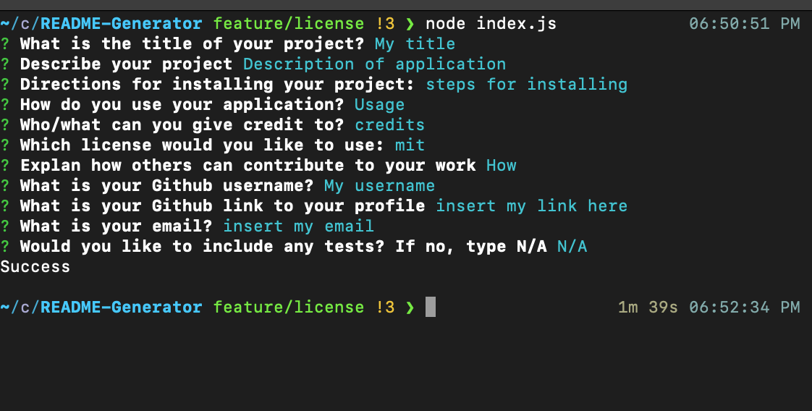

   # README-Generator

   ## Description
   
   The application allows a user to quickly generate a repo by inputting readme section. I made this application so that users can quicly create a readme.md file . This  application  reduces the time  a developer takes away from coding.  While creating this app I learned that inquirer allows user input through the command line and we can store the inputed valued into template literal.
   
   ## Table of contents
   
   - [Installation](#installation)
   - [Usage](#usage)
   - [Credits](#credits)
   - [License](#license)
   - [Contribute](#how-to-contribute)
   
   
   ## Installation
   N/A

   ## Usage
   
  A user can use this application by running node  index.js into the command line. Then the user will answer the  prompted questions. Once all questions are answered a new markdown file will be genereated with the answered input from the user.
   
  
   Here is an example of the prompted questions with inputs: 
   
  
   
   ## Credits
   
    I want to give credit to lukas-h as I used the links to licnese badges  via https://gist.github.com/lukas-h/2a5d00690736b4c3a7ba  I also want to give credit to the inquirer package as it allowed me to get user input. 

   ## License 
   
    This project is licensed under the terms of mit

   
   ## How to Contribute
   Other can provide feedback via my email listed below. 
   
   Contact me at: [Luis00809](https://github.com/Luis00809)
   
   You can also reach me at davidcarvajal008@gmail.com
   
   ## Tests
   
   N/A